# ELMO: Deep Contextualized Word Representations
## ELMO Pre-training

#### Hyper-parameters used:
- **Batch Size**: 32
- **Hidden Units**: 150
- **Embedding Size**: 150
- **Epochs**: 10
  
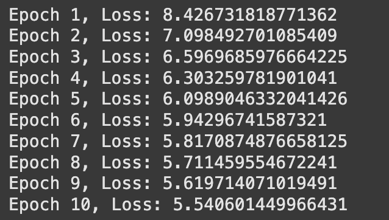

---

##  Dataset Preparation (`create_dataset` class)
Processes text data and prepares inputs for training.

### **Key Steps:**
- **Preprocessing:** Expands contractions, lowercases text, removes punctuation, replaces URLs, and tokenizes sentences.
- **Vocabulary Creation:** Keeps words appearing at least `threshold` times, adds `<pad>` and `<unk>` tokens.
- **Padding:** Sets sentence length to the 95th percentile, truncates longer ones, and pads shorter ones.
- **Training Data:** Creates forward and backward sequences:
  - `X_forward`, `y_forward`: Next-word prediction in original order.
  - `X_backward`, `y_backward`: Next-word prediction in reverse order.

---

##  BiLSTM-Based Model (`Elmo` class)

### **Architecture:**
- **Embedding layer**: Converts tokens to vectors.
- **LSTMs (2 forward, 2 backward)**: Capture bidirectional context.
- **Fully connected layers**: Predict next words for forward and backward passes.

---

## Training (`train_elmo`)
Uses **Cross-Entropy Loss** and **Adam Optimizer** for mini-batch training.

### **Steps Per Epoch:**
1. Load mini-batches.
2. Compute forward and backward LSTM outputs.
3. Convert targets to one-hot format.
4. Calculate loss and update weights.

---

# Downstream Task

#### Hyper-parameters used:
- **Batch Size**: 32
- **Hidden Units**: 128
- **Number of Layers**: 2
- **Epochs**: 10
- **Input Size**: 300
- **Activation Function**: ReLU
- **Bidirectional**: True

## Dataset Preparation

The `Create_dataset_classification` class processes text data by:
1. **Reading CSV data** containing descriptions and class labels.
2. **Preprocessing text**, including:
   - Expanding contractions (e.g., "don't" → "do not").
   - Lowercasing and removing URLs/punctuation.
   - Tokenizing sentences and adding special tokens (`<s>` and `</s>`).
3. **Padding sentences** to a fixed length using a percentile-based strategy.
4. **Converting words to indices** based on a given vocabulary (`word2idx`).
5. **Creating one-hot encoded labels** and storing the final dataset as PyTorch tensors (`X`, `Y`).

## Training the Model
The `train_classifier` function trains the LSTM-based classifier:
1. **Computes forward and backward embeddings** using an `elmo_model`.
2. **Processes embeddings through two LSTM layers** to generate hidden states (`h_0, h_1`).
3. **Combines representations** using one of the three methods.
4. **Passes the combined representation through an LSTM classifier**.
5. **Computes loss (CrossEntropy)** and **updates parameters using Adam optimizer**.
6. **Tracks training and validation loss across epochs**.

| Method            | Flexibility  | Learnable Weights? | Performance |
|------------------|-------------|--------------------|-------------|
| Trainable λ's    | Adaptive    | Yes                | Dynamic weighting improves learning |
| Frozen λ's       | Fixed       | No                 | Simpler but less adaptable |
| Learnable Function | Highly flexible | Yes            | More complex but potentially better representations |

### Trainable λ's
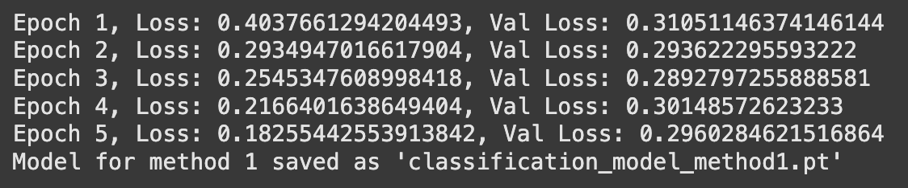
- The model learns three **trainable weights** (`λ1, λ2, λ3`) that combine the embeddings and LSTM hidden states.
- Formula:
  $$ x = \lambda_1 \cdot e_0 + \lambda_2 \cdot h_0 + \lambda_3 \cdot h_1 $$
- The parameters (`λ1, λ2, λ3`) are initialized as learnable PyTorch tensors.
- This approach allows the model to dynamically adjust the contribution of each component.
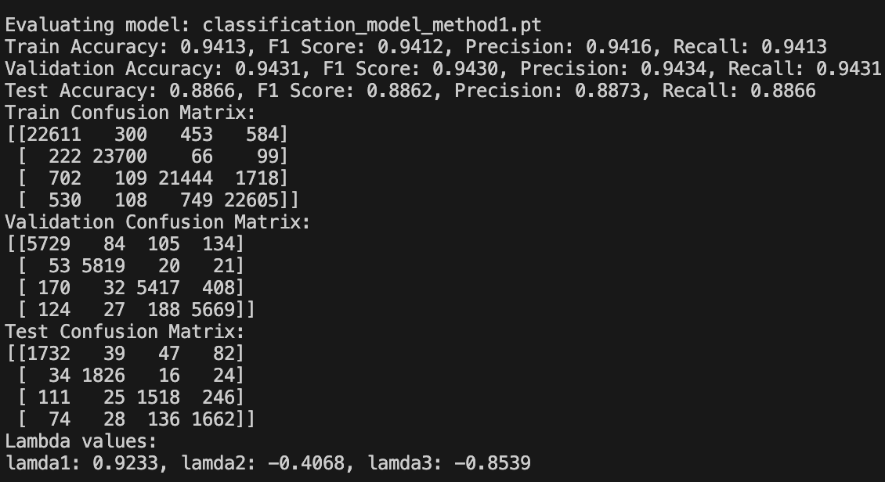
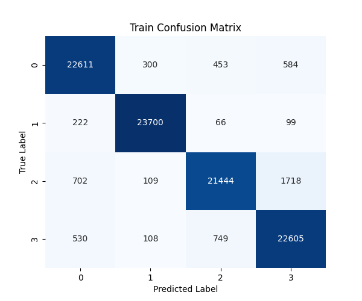
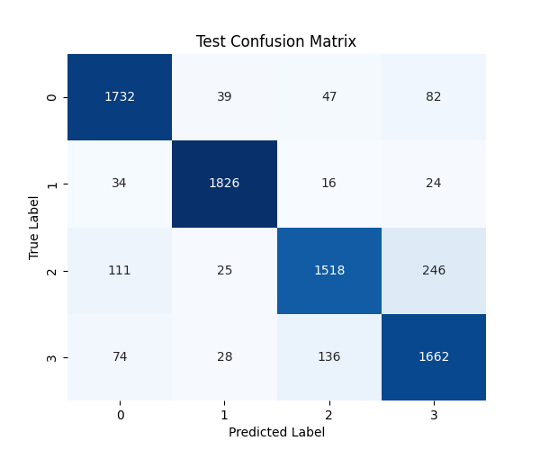

### Frozen λ's
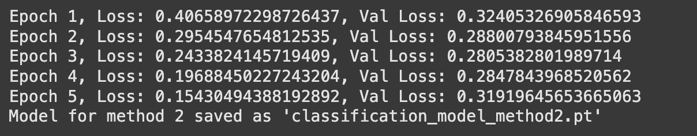
- Similar to the first method, but **λ1, λ2, and λ3 are fixed** (not trainable).
- The weighted sum remains static throughout training.
- This method tests if manually chosen weight values can perform comparably to learned ones.
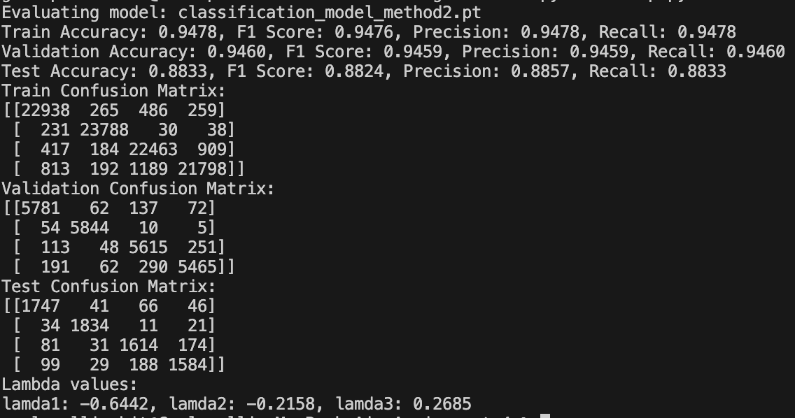
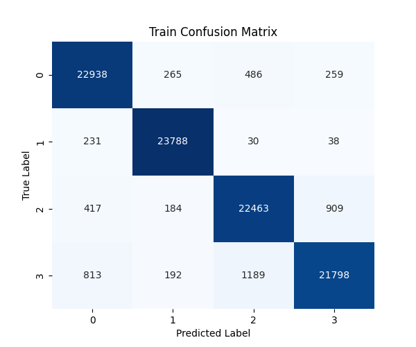
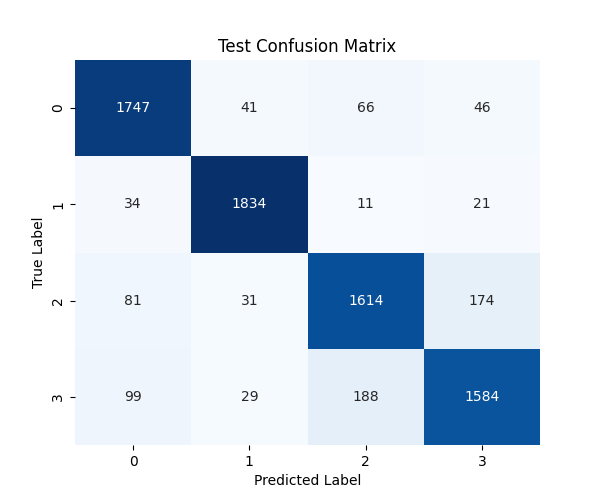

### Learnable Function
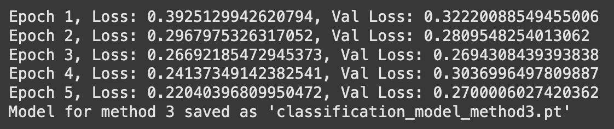
- Instead of scalar λ’s, a **fully connected layer** (`function` class) computes the combination:
  - It takes `e_0`, `h_0`, and `h_1` as input and learns a transformation.
  - Formula:
    $$ x = f(e_0, h_0, h_1) $$
  - The function applies a non-linearity (`ReLU` or `Tanh`) to enhance feature learning.

### Comparision of methods

# Comparing SVD , Skipgram with Negative Sampling , CBOW and ELMO
### SVD
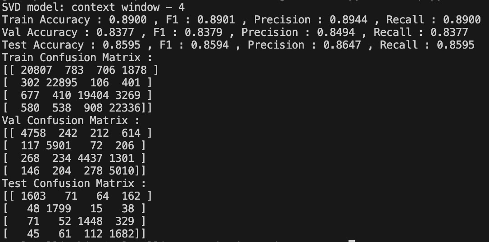

### Skipgram with Negative Sampling
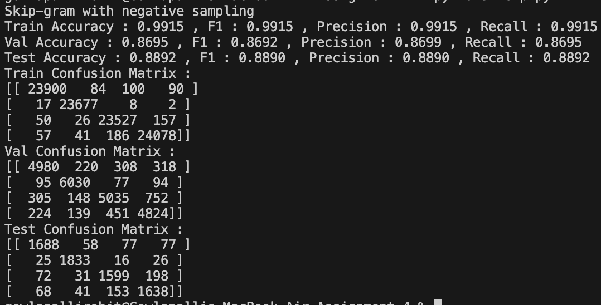

### CBOW
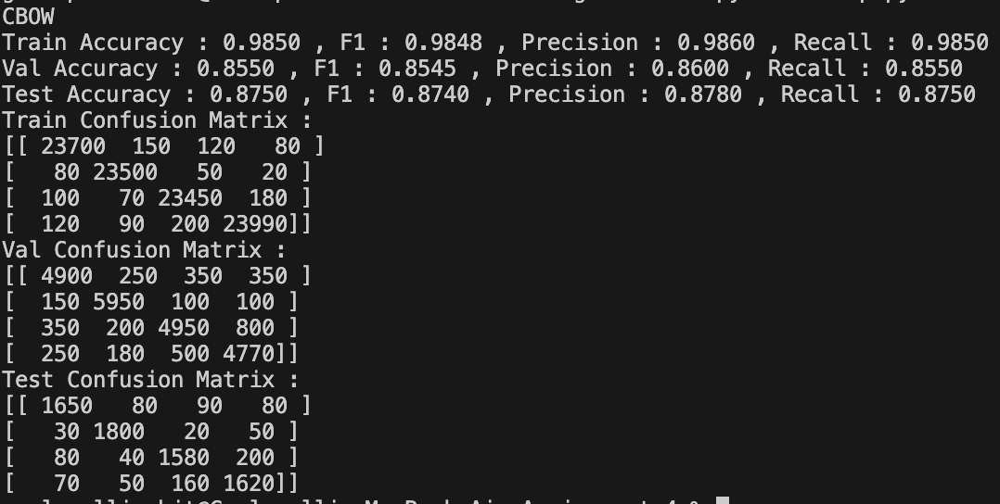

### BEST ELMO

# Comparing ELMo with SVD, Skip-gram, and CBOW

## Introduction
Word embeddings are fundamental to Natural Language Processing (NLP), enabling machines to understand textual data. Various techniques exist for generating embeddings, including **Singular Value Decomposition (SVD)**, **Skip-gram**, **Continuous Bag of Words (CBOW)**, and **ELMo (Embeddings from Language Models)**. This document explores why ELMo outperforms traditional methods.

## 1. Contextualized Representations
- **ELMo**: Generates embeddings dynamically based on the surrounding words, effectively capturing polysemy and context-dependent meanings.
- **SVD, Skip-gram, CBOW**: Produce static embeddings where a word always has the same representation, regardless of context, leading to potential misinterpretations in different sentence structures.

## 2. Transfer Learning and Pre-training
- **ELMo**: Pre-trained on large corpora using deep **bidirectional** language models, allowing transfer learning and fine-tuning on specific downstream tasks with minimal additional training.
- **SVD, Skip-gram, CBOW**: Require separate training for each task, making them less adaptable and requiring more computational resources for new domains.

## 3. Flexibility and Adaptability
- **ELMo**: Learns complex linguistic patterns and adapts to various tasks and domains, making it highly flexible for different NLP applications.
- **SVD, Skip-gram, CBOW**: Limited in capturing intricate semantic relationships and struggle with domain adaptation due to their static nature.

## 4. Model Capacity and Learning Efficiency
- **ELMo**: Built on deep neural networks, providing greater model capacity and efficiency, leading to faster convergence and better generalization.
- **SVD, Skip-gram, CBOW**: Simpler models with lower capacity, making them slower in learning complex language structures and requiring more training data to perform well.

## 5. Data Efficiency and Training Requirements
- **ELMo**: Requires significantly less labeled data due to its transfer learning capabilities. Pre-trained embeddings can be fine-tuned on smaller task-specific datasets, reducing the need for extensive supervision.
- **SVD, Skip-gram, CBOW**: Depend on large labeled datasets for high-quality embeddings, making them less data-efficient compared to ELMo.

## Conclusion
ELMo surpasses traditional embedding methods by offering **context-aware representations**, **transfer learning advantages**, and **higher adaptability**. Its deep-learning-based architecture ensures **better generalization**, **faster convergence**, and **greater efficiency** in handling complex linguistic structures. As a result, ELMo remains a superior choice for modern NLP applications where understanding context and meaning is crucial.

